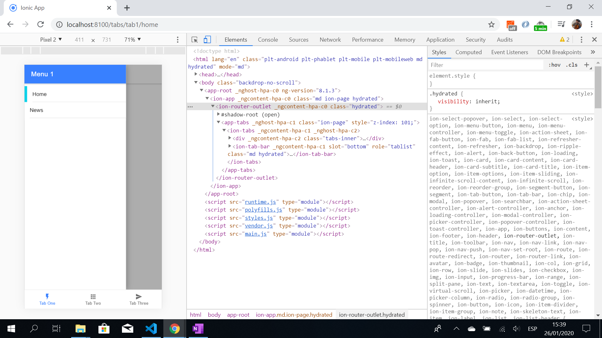

# :zap: Ionic Multiple Menus

* App that displays different menus for tabs 1 and 2.

## :page_facing_up: Table of contents

* [:zap: Ionic Multiple Menus](#zap-ionic-multiple-menus)
  * [:page_facing_up: Table of contents](#page_facing_up-table-of-contents)
  * [:books: General info](#books-general-info)
  * [:camera: Screenshots](#camera-screenshots)
  * [:signal_strength: Technologies](#signal_strength-technologies)
  * [:floppy_disk: Setup](#floppy_disk-setup)
  * [:computer: Code Examples](#computer-code-examples)
  * [:cool: Features](#cool-features)
  * [:clipboard: Status & To-do list](#clipboard-status--to-do-list)
  * [:clap: Inspiration](#clap-inspiration)
  * [:envelope: Contact](#envelope-contact)

## :books: General info

* Tab1 and Tab2 both contain ion-menus and a side-bar with routing to 2 pages.

## :camera: Screenshots




## :signal_strength: Technologies

* [Ionic v5](https://ionicframework.com/)
* [Angular v10](https://angular.io/)
* [Ionic/angular v5](https://www.npmjs.com/package/@ionic/angular)

## :floppy_disk: Setup

* To start the server on _localhost://8100_ type: 'ionic serve'

## :computer: Code Examples

* Tab1 page code to show first (of two) menus using the [Ionic MenuController provider](https://ionicframework.com/docs/v3/api/components/app/MenuController/).

```typescript
export class Tab1Page {
  panelEnabled = true;
  constructor(private menuController: MenuController) {}

  ionViewWillEnter() {
    this.panelEnabled = true;
    this.menuController.enable(true, 'first');
  }

  ionViewWillLeave() {
    this.panelEnabled = false;
  }
```

## :cool: Features

* Uses a `panelEnabled` boolean value to control menu disabling.

## :clipboard: Status & To-do list

* Status: Working
* To-do: nothing.

## :clap: Inspiration

* [Simon Grimm, Ionic Academy Tutorial: Multiple Side Menus With Ionic Tab Bar](https://www.youtube.com/watch?v=4VYC725VMNA)

## :envelope: Contact

* Repo created by [ABateman](https://www.andrewbateman.org) - you are welcome to [send me a message](https://andrewbateman.org/contact)
